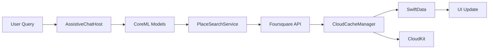
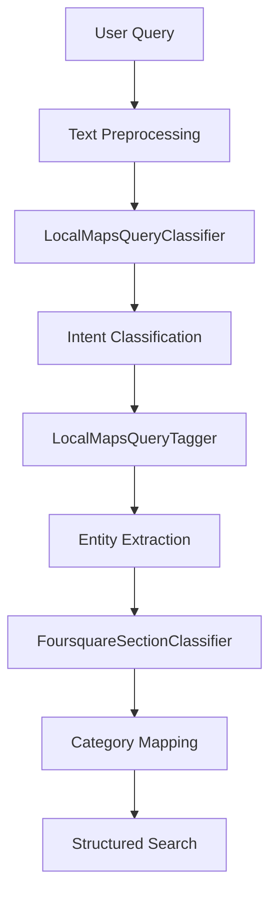

# Know Maps


> An AI-powered location discovery companion that understands natural language. Built entirely with SwiftUI and on-device Machine Learning.

## Overview

Know Maps reimagines location discovery through natural language understanding and personalized AI recommendations. Instead of searching for "coffee shops near me," simply say "I'm in the mood for live music" or "Where can I find authentic ramen?" The app uses on-device CoreML models to understand your intent, classify queries, and deliver contextual results—all while keeping your data private.

Unlike traditional mapping apps that focus on navigation, Know Maps acts as a "smart concierge" for contextual exploration. It learns your preferences over time, syncs them across all your Apple devices via iCloud, and provides increasingly personalized suggestions without ever sending your personal data to external servers.

Built with 95%+ shared code across iPhone, iPad, Mac, and Vision Pro, Know Maps showcases modern Swift development practices including SwiftUI, SwiftData, CloudKit, on-device CoreML, and comprehensive Swift concurrency patterns.

## Features

### Core Capabilities

- **Natural Language Query Processing**: Ask questions like "I want somewhere cozy to work" and get contextual results
- **Four Exploration Modes**:
  - ❤️ **Favorites** - Your saved places and preferences with personalized ratings
  - 🏭 **Industries** - Category-based browsing (restaurants, bars, museums, etc.)
  - ✨ **Tastes & Features** - Vibe-based exploration ("romantic," "outdoor seating," "live music")
  - 📍 **Places** - Map-based discovery with search and recommendations
- **Personalized Rating System**: Rate categories 0-3 stars to influence future recommendations
- **Foursquare-Powered Search**: Access comprehensive place data including photos, hours, ratings, and reviews
- **Real-Time Results**: Fast, responsive search with concurrent API request management

### AI & Machine Learning

- **4 On-Device CoreML Models**:
  - `LocalMapsQueryClassifier` - Classifies user intent (Search, Place details, Location, etc.)
  - `LocalMapsQueryTagger` - Extracts entities like cuisine types, features, and locations
  - `FoursquareSectionClassifier` - Maps categories to Foursquare taxonomy
  - `MiniLM-L12-Embedding` - Text embeddings for semantic search (66MB model)
- **Semantic Search**: Intelligent query understanding powered by MiniLM text embeddings
- **Privacy-First ML**: All machine learning processing happens entirely on-device
- **Transparent Training**: ML model training data included in the repository (`/Model/ML/`)
- **Intent Classification**: Automatically determines whether you're searching, asking about a place, or exploring

### Multi-Platform Experience

- **Native SwiftUI**: 100% declarative UI across all Apple platforms
- **Adaptive Layouts**: `NavigationSplitView` provides seamless 2/3-column layouts on iPhone, iPad, Mac
- **Vision Pro Support**: Immersive spatial experiences with RealityKit
- **Siri Integration**: Voice commands via App Shortcuts ("I'm in the mood for brunch")
- **TipKit Onboarding**: Contextual tips guide users through features
- **Responsive Design**: Optimized for every screen size and input method

### Privacy & Data

- **On-Device ML**: No personal queries or preferences sent to external servers
- **Private iCloud Database**: User data syncs via CloudKit private database (`iCloud.com.secretatomics.knowmaps.Cache`)
- **Local-First Architecture**: SwiftData provides offline-capable local persistence
- **Sign in with Apple**: Secure, privacy-focused authentication
- **Minimal Data Collection**: Only place search queries sent to Foursquare API (required for results)
- **No Third-Party Tracking**: Analytics use privacy-focused Segment with opt-out capability

## Getting Started

### Prerequisites

- **Xcode 15.0+** (for iOS 17/macOS 14/visionOS support)
- **macOS Sonoma 14.0+** (required for Xcode 15)
- **Apple Developer Account** (for CloudKit and Sign in with Apple)
- **Foursquare API Key** (register at [developer.foursquare.com](https://developer.foursquare.com))

### Installation

```bash
# Clone the repository
git clone https://github.com/voxels/Know-Maps.git
cd Know-Maps/Know\ Maps

# Open in Xcode
open "Know Maps.xcodeproj"
```

### Configuration

1. **CloudKit Setup**:
   - Enable CloudKit in Signing & Capabilities
   - Verify container: `iCloud.com.secretatomics.knowmaps.Cache`

2. **API Keys**:
   - Configure Foursquare API credentials via Supabase setup
   - (Optional) Add Segment Analytics key

3. **Signing**:
   - Update bundle identifier in project settings
   - Select your Apple Developer team

### Building

```bash
# Build for iOS Simulator
xcodebuild -project "Know Maps.xcodeproj" -scheme "Know Maps" \
  -destination 'platform=iOS Simulator,name=iPhone 15' build

# Build for macOS
xcodebuild -project "Know Maps.xcodeproj" -scheme "Know Maps" \
  -destination 'platform=macOS' build

# Build for visionOS (requires Xcode 15.2+)
xcodebuild -project "Know Maps.xcodeproj" -scheme "Know Maps" \
  -destination 'platform=visionOS Simulator' build
```

### Running Tests

```bash
# Run all tests
xcodebuild test -project "Know Maps.xcodeproj" -scheme "Know MapsTests" \
  -destination 'platform=iOS Simulator,name=iPhone 15'

# Run specific test class
xcodebuild test -project "Know Maps.xcodeproj" -scheme "Know MapsTests" \
  -destination 'platform=iOS Simulator,name=iPhone 15' \
  -only-testing:Know_MapsTests/DefaultModelControllerTests

# Run single test method
xcodebuild test -project "Know Maps.xcodeproj" -scheme "Know MapsTests" \
  -destination 'platform=iOS Simulator,name=iPhone 15' \
  -only-testing:Know_MapsTests/DefaultModelControllerTests/testRefreshModelSanitizesQuery
```

## Tech Stack

### Core Technologies

- **SwiftUI** - 100% declarative UI across all platforms
- **SwiftData** - Local persistence with automatic CloudKit sync
- **CoreML** - On-device machine learning models (4 models: classifier, tagger, section classifier, embeddings)
- **CloudKit** - Private iCloud database for user data synchronization
- **CoreLocation & MapKit** - Location services and interactive maps
- **Swift Concurrency** - Extensive use of `async/await`, `Task`, and `Actor` patterns
- **TipKit** - Contextual user education and feature discovery
- **AppIntents** - Siri shortcuts and system integration

### Architecture

- **Pattern**: Model-View-ViewModel (MVVM) with centralized controller
- **State Management**: `@Observable`, `@StateObject`, SwiftUI bindings
- **Dependency Injection**: Protocol-based with `AppDependencyManager`
- **Concurrency Control**: `DetailFetchLimiter` actor throttles concurrent API requests (limit: 4)
- **Error Handling**: Comprehensive error tracking with `SegmentAnalyticsService`

### Dependencies (Swift Package Manager)

- **[Nuke](https://github.com/kean/Nuke)** - High-performance image loading and caching
- **[Segment Analytics](https://github.com/segmentio/analytics-swift)** - Privacy-focused analytics SDK
- **[Supabase Swift](https://github.com/supabase/supabase-swift)** - Backend services and configuration

## Architecture Overview

### Layered Architecture

Know Maps follows a strict 5-layer architecture pattern with clear separation of concerns:

**View Layer** → **ViewModel Layer** → **Controller Layer** → **Service Layer** → **Data Layer**

Each layer has specific responsibilities and communicates only with adjacent layers, ensuring maintainability, testability, and scalability across all Apple platforms.

```mermaid
graph TB
    subgraph "View Layer (SwiftUI)"
        V1[ContentView]
        V2[SavedListView]
        V3[PlacesList]
        V4[PlaceView]
        V5[SearchView]
        V6[PlaceAboutView]
        V7[PlaceDirectionsView]
        V8[PlacePhotosView]
    end

    subgraph "ViewModel Layer"
        VM1[ChatResultViewModel]
        VM2[SearchSavedViewModel]
        VM3[PlaceDirectionsViewModel]
        VM4[PlaceAboutViewModel]
    end

    subgraph "Controller Layer"
        C[DefaultModelController<br/>@Observable @MainActor<br/>Central Coordinator]
    end

    subgraph "Service Layer"
        S1[AssistiveChatHostService<br/>NL Processing]
        S2[DefaultPlaceSearchService<br/>Foursquare API]
        S3[DefaultLocationService<br/>CoreLocation]
        S4[CloudCacheManager<br/>Cache Orchestration]
        S5[CloudCacheService<br/>CloudKit Operations]
        S6[DefaultRecommenderService<br/>Personalization]
        S7[SegmentAnalyticsService<br/>Analytics]
        S8[VectorEmbeddingService<br/>ML Embeddings]
    end

    subgraph "Data Layer"
        D1[(SwiftData<br/>UserCachedRecord<br/>RecommendationData)]
        D2[(CloudKit<br/>Private Database<br/>iCloud Sync)]
        D3[CoreML Models<br/>QueryClassifier<br/>QueryTagger<br/>SectionClassifier]
    end

    subgraph "External APIs"
        E1[Foursquare API<br/>Place Search<br/>Place Details]
    end

    %% View to ViewModel
    V1 --> VM1
    V2 --> VM2
    V4 --> VM3
    V4 --> VM4

    %% ViewModel to Controller
    VM1 --> C
    VM2 --> C
    VM3 --> C
    VM4 --> C

    %% Views to Controller (direct @Observable binding)
    V1 -.-> C
    V2 -.-> C
    V3 -.-> C
    V4 -.-> C
    V5 -.-> C
    V6 -.-> C
    V7 -.-> C
    V8 -.-> C

    %% Controller to Services
    C --> S1
    C --> S2
    C --> S3
    C --> S4
    C --> S6
    C --> S7

    %% Service interactions
    S1 --> D3
    S1 --> S8
    S2 --> E1
    S4 --> S5
    S5 --> D1
    S5 --> D2
    S6 --> D1

    %% Data Layer sync
    D1 <-.->|Automatic Sync| D2

    %% Styling
    classDef viewLayer fill:#e1f5fe
    classDef viewModelLayer fill:#fff9c4
    classDef controllerLayer fill:#ffccbc
    classDef serviceLayer fill:#c8e6c9
    classDef dataLayer fill:#f8bbd0
    classDef externalLayer fill:#eeeeee

    class V1,V2,V3,V4,V5,V6,V7,V8 viewLayer
    class VM1,VM2,VM3,VM4 viewModelLayer
    class C controllerLayer
    class S1,S2,S3,S4,S5,S6,S7,S8 serviceLayer
    class D1,D2,D3 dataLayer
    class E1 externalLayer
```

> **Note**: For a high-resolution static version of this diagram, see [docs/architecture-diagram.png](docs/architecture-diagram.png) (to be added).

### Layer Responsibilities

#### 1. View Layer (SwiftUI) 🔵

Pure SwiftUI views with no business logic:
- **Responsibilities**: UI rendering, user interaction handling, layout adaptation
- **Bindings**: Observes ViewModels and Controller via `@Observable` properties
- **Platform Adaptation**: Uses `NavigationSplitView` for adaptive 2/3-column layouts across iPhone, iPad, Mac
- **Key Files**: `ContentView.swift`, `SavedListView.swift`, `PlacesList.swift`, `PlaceView.swift`

#### 2. ViewModel Layer (Yellow)  🟡

View-specific state management and presentation logic:
- **Responsibilities**: UI formatting, view-specific state, user input validation
- **Delegation**: Business logic delegated to Controller layer
- **Lifecycle**: Managed by SwiftUI view lifecycle (`@StateObject`, `@ObservedObject`)
- **Examples**: `ChatResultViewModel` manages chat interface state, `SearchSavedViewModel` handles favorites UI

#### 3. Controller Layer (Orange) 🟠

`DefaultModelController` acts as the central coordinator:
- **Responsibilities**: Application state management, service orchestration, data flow coordination
- **Concurrency**: Marked `@MainActor` for thread-safe UI updates, uses actor pattern for API throttling
- **Observable**: Publishes state changes via SwiftUI's `@Observable` macro
- **Single Source of Truth**: All app state flows through this controller

#### 4. Service Layer (Green) 🟢

Protocol-based services with single responsibilities:
- **AssistiveChatHostService**: Natural language processing using CoreML models
- **DefaultPlaceSearchService**: Foursquare API integration for place data
- **DefaultLocationService**: Wraps CoreLocation for location services
- **CloudCacheManager**: Orchestrates caching strategy (what to cache, when to sync)
- **CloudCacheService**: Handles actual CloudKit operations (network calls, record management)
- **DefaultRecommenderService**: Personalization engine using user ratings
- **SegmentAnalyticsService**: Privacy-focused event tracking
- **VectorEmbeddingService**: ML embeddings for semantic search

**Design Principle**: Services are injected via dependency injection, enabling easy testing with mocks.

#### 5. Data Layer (Pink) 🩷

Persistent storage and on-device ML:
- **SwiftData**: Local persistence with models (`UserCachedRecord`, `RecommendationData`)
- **CloudKit**: Automatic sync to iCloud private database
- **CoreML Models**: 4 on-device models for intent classification, entity extraction, category mapping, and semantic search
- **Sync Strategy**: SwiftData ↔ CloudKit bidirectional sync ensures consistency

### External Dependencies

**Foursquare API** (Gray): Provides place search, details, photos, and reviews. All place data is cached locally to support offline browsing and reduce API calls.

## Architecture Deep Dive

### Design Pattern: MVVM with Centralized Controller

Know Maps follows a **Model-View-ViewModel (MVVM)** architecture with a centralized controller pattern:

- **View Layer**: Pure SwiftUI views (`ContentView`, `SearchView`, `PlaceView`, `SavedListView`)
- **ViewModel Layer**: Specialized view models for specific UI concerns (`ChatResultViewModel`, `SearchSavedViewModel`)
- **Controller Layer**: `DefaultModelController` acts as the central "brain," coordinating services, data models, and UI state

This architecture provides:
- **Separation of Concerns**: Each layer has clearly defined responsibilities
- **Testability**: Protocol-based design enables comprehensive unit testing with mocks
- **Scalability**: Centralized state management scales across complex multi-platform UIs
- **Performance**: Actor-based concurrency prevents race conditions and API saturation

### Key Components

| Component | Purpose | Location |
|-----------|---------|----------|
| `DefaultModelController` | Central state management, coordinates all services | `Model/Controllers/DefaultModelController.swift` |
| `AssistiveChatHostService` | Natural language processing and intent classification | `Model/Controllers/AssistiveChatHostService.swift` |
| `CloudCacheManager` | CloudKit sync orchestration and cache management | `Model/Controllers/CloudCacheManager.swift` |
| `DefaultPlaceSearchService` | Foursquare API integration and place data fetching | `Model/Controllers/DefaultPlaceSearchService.swift` |
| `DefaultLocationService` | CoreLocation wrapper and location authorization | `Model/Controllers/DefaultLocationService.swift` |
| `SegmentAnalyticsService` | Privacy-focused analytics and error tracking | `Model/Controllers/SegmentAnalyticsService.swift` |
| `VectorEmbeddingService` | Semantic embeddings for intelligent search | `Model/ML/VectorEmbeddingService.swift` |

### Data Flow



**Flow Explanation**:

1. **User Input**: Natural language query entered in search field
2. **Intent Classification**: `AssistiveChatHostService` uses CoreML to classify intent
3. **Query Construction**: Structured search parameters built from extracted entities
4. **API Request**: `DefaultPlaceSearchService` queries Foursquare with location context
5. **Cache Update**: Results stored in SwiftData and synced to CloudKit
6. **UI Update**: `@Observable` properties trigger SwiftUI view re-renders

### ML Pipeline

The on-device machine learning pipeline processes queries through multiple stages:



**Pipeline Stages**:

1. **Text Preprocessing**: Tokenization, normalization, and cleaning
2. **Intent Classification**: Determines query type (Search, Place details, Location, Autocomplete)
3. **Entity Extraction**: Identifies cuisines, features, locations, price points
4. **Category Mapping**: Maps natural language to Foursquare category taxonomy
5. **Embedding Generation**: Creates semantic vectors for similarity ranking

**Code Example**:

```swift
// Example: Natural language to structured search
let query = "I'm in the mood for live music with a view"

// On-device CoreML classifies intent and extracts entities
// → Intent: .Search
// → Entities: ["live music", "view"]
// → Foursquare categories: ["Music Venue", "Rooftop Bar"]

// Query Foursquare API with structured parameters
let results = try await placeSearchService.search(
    near: currentLocation,
    categories: extractedCategories,
    features: extractedFeatures
)

// Results cached in SwiftData + CloudKit sync
await cacheManager.cache(results)
```

All ML models run entirely on-device using Apple's CoreML framework—no queries or user data are sent to external servers for processing.

## Project Structure

```
Know Maps/
├── Know Maps Prod/
│   ├── Model/
│   │   ├── Controllers/              # Services and central controller
│   │   │   ├── DefaultModelController.swift
│   │   │   ├── AssistiveChatHostService.swift
│   │   │   ├── CloudCacheManager.swift
│   │   │   ├── CloudCacheService.swift
│   │   │   ├── DefaultPlaceSearchService.swift
│   │   │   ├── DefaultLocationService.swift
│   │   │   └── SegmentAnalyticsService.swift
│   │   ├── Models/                   # Data models and response types
│   │   │   ├── UserCachedRecord.swift
│   │   │   ├── RecommendationData.swift
│   │   │   ├── CategoryResult.swift
│   │   │   └── ChatResult.swift
│   │   ├── Network/                  # Network session handlers
│   │   │   └── PlaceSearchSession.swift
│   │   ├── ViewModels/               # View-specific logic
│   │   │   ├── ChatResultViewModel.swift
│   │   │   └── SearchSavedViewModel.swift
│   │   ├── ML/                       # CoreML models and training data
│   │   │   ├── LocalMapsQueryClassifier.mlmodel
│   │   │   ├── LocalMapsQueryTagger.mlmodel
│   │   │   ├── FoursquareSectionClassifier.mlmodel
│   │   │   ├── QueryClassifierTrainingData.json
│   │   │   └── VectorEmbeddingService.swift
│   │   └── Protocols/                # Protocol definitions
│   ├── View/                         # SwiftUI views
│   │   ├── ContentView.swift         # Root navigation structure
│   │   ├── SavedListView.swift       # Favorites display
│   │   ├── PlacesList.swift          # Search results
│   │   ├── PlaceView.swift           # Place details
│   │   └── SearchView.swift          # Search interface
│   ├── Assets.xcassets/              # Images and assets
│   └── Know_MapsApp.swift            # App entry point with ModelContainer
│
├── Know MapsTests/                   # Unit tests
│   ├── Mocks/                        # Mock service implementations
│   │   ├── MockCacheManager.swift
│   │   ├── MockPlaceSearchService.swift
│   │   └── MockLocationService.swift
│   ├── DefaultModelControllerTests.swift
│   └── TestFixtures.swift            # Shared test data
│
└── Know Maps.xcodeproj               # Xcode project file
```

## Development

### Common Commands

```bash
# Open in Xcode
open "Know Maps.xcodeproj"

# Build for different platforms
xcodebuild -project "Know Maps.xcodeproj" -scheme "Know Maps" -destination 'platform=iOS Simulator,name=iPhone 15' build
xcodebuild -project "Know Maps.xcodeproj" -scheme "Know Maps" -destination 'platform=macOS' build

# Run tests
xcodebuild test -project "Know Maps.xcodeproj" -scheme "Know MapsTests" -destination 'platform=iOS Simulator,name=iPhone 15'
```

### Testing Strategy

- **Unit Tests**: Protocol-based mocks in `/Know MapsTests/Mocks/` enable isolated component testing
- **Test Fixtures**: Reusable test data in `TestFixtures.swift` ensures consistent test scenarios
- **Async Testing**: Proper `async/await` patterns with Swift Testing utilities
- **State Testing**: Comprehensive `DefaultModelController` state transition tests
- **Integration Testing**: Tests verify service coordination and data flow

**Example Test**:

```swift
func testRefreshModelSanitizesQuery() async throws {
    let mockInputValidator = MockInputValidationServiceV2()
    mockInputValidator.mockSanitizedQuery = "pizza"

    let controller = DefaultModelController(
        inputValidator: mockInputValidator,
        cacheManager: MockCacheManager()
    )

    await controller.refreshModel(with: "  pizza!!!  ")

    XCTAssertTrue(mockInputValidator.sanitizeQueryCalled)
    XCTAssertEqual(controller.currentQuery, "pizza")
}
```

### Contributing

Contributions are welcome! Here's how to get started:

1. **Fork the repository**
2. **Create a feature branch** (`git checkout -b feature/amazing-feature`)
3. **Follow the existing architecture**:
   - Use protocol-based dependency injection for testability
   - Add comprehensive tests for new functionality
   - Follow Swift API Design Guidelines
   - Use `@MainActor` for UI-bound types
   - Prefer `async/await` over completion handlers
4. **Commit your changes** (`git commit -m 'Add amazing feature'`)
5. **Push to the branch** (`git push origin feature/amazing-feature`)
6. **Open a Pull Request**

#### Code Style Guidelines

- **Swift API Design**: Follow [Swift API Design Guidelines](https://swift.org/documentation/api-design-guidelines/)
- **Concurrency**: Use `@MainActor` for view models and controllers, `Actor` for shared mutable state
- **Async Patterns**: Prefer `async/await` and structured concurrency over callbacks
- **Documentation**: Document complex algorithms, especially ML pipelines and cache synchronization
- **Testing**: Add unit tests for all new services and controllers
- **SwiftUI**: Keep views focused—extract complex logic to view models

## Roadmap

### Recently Shipped ✨

Significant V2 architecture improvements merged from `antigravity` branch (December 2024):

- ✅ **Performance Optimizations**: ResultIndexServiceV2 provides O(1) dictionary-based lookups (vs O(n) array scans)
- ✅ **Enhanced ML Integration**: Advanced text embedding models with MiniLM-L12 for semantic search
- ✅ **FoursquareSectionClassifier**: New CoreML model for improved category mapping
- ✅ **Input Validation**: DefaultInputValidationServiceV2 for query sanitization
- ✅ **Expanded Test Coverage**: 1,500+ lines of new test code with comprehensive mocks
- ✅ **Documentation**: Comprehensive CLAUDE.md and ModelInterfaces.md

### Planned Features

- [ ] Offline mode with local caching and queue sync
- [ ] Custom ML model training pipeline for user-specific intent classification
- [ ] Collaborative lists and place sharing
- [ ] Apple Watch companion app
- [ ] Enhanced Vision Pro spatial experiences with 3D place visualization

### Community Requests

See [Issues](https://github.com/voxels/Know-Maps/issues) for feature requests and discussions.

## License

This project is licensed under the MIT License - see the [LICENSE](LICENSE) file for details.

```
Copyright (c) 2024 voxels
```

## Acknowledgments

- **Foursquare** for comprehensive place data API
- **Apple** for SwiftUI, CoreML, CloudKit, and the entire platform ecosystem
- **Open Source Community** for excellent dependencies: Nuke, Segment Analytics, Supabase Swift
- All contributors who have helped improve Know Maps

## Contact

- **GitHub**: [@voxels](https://github.com/voxels)
- **Repository**: [Know-Maps](https://github.com/voxels/Know-Maps)
- **Issues**: [Report bugs or request features](https://github.com/voxels/Know-Maps/issues)

---

Built with ❤️ using SwiftUI, CoreML, and modern Swift concurrency
